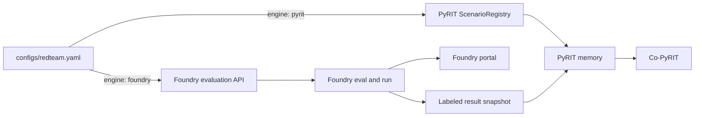

# Red Teaming Accelerator Workshop

**Goal:** choose PyRIT or the Foundry cloud agent in configuration, run one bounded test, inspect its native evidence,
and understand the engines' capability and security boundaries.

**Rule:** continue only after the target owner approves targets, data, risks, strategies, turns, rates, and retention.

## 1. Install

The repository uses the Microsoft package-feed proxy at `https://packagefeedproxy.microsoft.io/pypi/simple` for every
Python dependency installation.

```powershell
$env:PIP_INDEX_URL = "https://packagefeedproxy.microsoft.io/pypi/simple"
python -m venv .venv
.\.venv\Scripts\Activate.ps1
python -m pip install --upgrade pip
python -m pip install -e ".[dev,foundry,playwright]"
playwright install chromium
az login
```

Verify the pinned tools:

```powershell
pyrit_scan --help
pyrit_shell --help
foundry-scan validate --config configs/foundry.yaml
rta validate --config configs/redteam.yaml
```

## 2. Understand the two engines



- Native PyRIT owns scenarios, techniques, datasets, shell, backend, and Co-PyRIT.
- The selector delegates cloud work to `azure-ai-projects`; it never implements its own attack loop.
- A native PyRIT record is not a Foundry portal evaluation. Imported cloud rows are labeled snapshots.
- Foundry model runs use service-generated objectives; custom YAML objectives are a PyRIT capability.

## 3. Inspect and choose a profile

Open [../configs/redteam.yaml](../configs/redteam.yaml). It includes:

- `baseline-pyrit` and `baseline-foundry`, with the same logical target, risks, attacks, turn depth, and labels
- `custom-pyrit`, which reads [../configs/objectives/custom-policy-checks.yaml](../configs/objectives/custom-policy-checks.yaml)
- a dual target binding so changing `engine` does not require changing the logical target name

Run offline plans:

```powershell
rta list --config configs/redteam.yaml
rta plan baseline-pyrit --config configs/redteam.yaml --json
rta plan baseline-foundry --config configs/redteam.yaml --json
rta plan custom-pyrit --config configs/redteam.yaml --json
```

Confirm the PyRIT plan shows a per-risk objective count and the Foundry plan shows `service_managed`. The cloud API
does not currently expose an objective-count field for model red-team runs.

## 4. Inspect the real targets

Open [../configs/pyrit/targets.yaml](../configs/pyrit/targets.yaml) and confirm:

- the project endpoint is the approved project
- `grta-openai` and `grta-mistral` exist in that project
- authentication uses the explicit `https://ai.azure.com/.default` scope
- the harmless dataset contains one objective
- Mistral is the configured scorer target

Those names are existing Azure resource IDs, not current product branding. Do not rename deployed resources as part
of an RTA upgrade; new infrastructure defaults use `rta-*` names.

Open [../configs/foundry.yaml](../configs/foundry.yaml) and compare the exact publisher, deployment, model, and version.
Anthropic is deliberately blocked because the subscription Marketplace policy rejected its paid offer.

## 5. List targets with native PyRIT

After written authorization:

```powershell
$env:REDTEAM_SCOPE_APPROVED = "true"
pyrit_scan --config-file configs/pyrit/pyrit-config.yaml --start-server --list-targets
```

Confirm `foundry-openai` and `foundry-mistral` appear. This initialization creates no model request.

## 6. Run one bounded baseline profile

The selected profile uses PyRIT's upstream Foundry RedTeamAgent scenario, not a repository attack implementation:

```powershell
$env:REDTEAM_SCOPE_APPROVED = "true"
rta run baseline-pyrit --config configs/redteam.yaml
```

It runs direct baseline probes plus Base64 and native `CrescendoAttack`, with the configured maximum of three turns.
Results are written directly to PyRIT memory with the profile labels.

The direct native CLI remains available for ad hoc scenario work:

```powershell
pyrit_scan airt.jailbreak `
  --config-file configs/pyrit/pyrit-config.yaml `
  --start-server `
  --target foundry-openai `
  --techniques prompt_sending `
  --dataset-names foundry-canary `
  --max-dataset-size 1 `
  --max-concurrency 1 `
  --memory-labels '{"platform":"foundry","provider":"openai","purpose":"workshop"}' `
  --include-baseline false `
  --jailbreak-names aligned.yaml `
  --num-jailbreak-attempts 1
```

This calls the real `grta-openai` deployment using the OpenAI-compatible Chat Completions transport. A content-filter
block is a valid model-side result, not a transport failure.

## 7. Run custom objectives

Review every objective and its authorization boundary before execution, then run:

```powershell
rta run custom-pyrit --config configs/redteam.yaml
```

Add cases by editing the objective YAML; no Python change is required. Do not add credentials, personal information,
production records, or realistic secrets. Use synthetic markers and a non-production target.

Changing this profile to `engine: foundry` fails validation because Foundry cloud model runs do not accept arbitrary
objective files. For Foundry agents, generate and independently review the service taxonomy before an agentic run.

## 8. Inspect Co-PyRIT

Start or reuse the loopback backend:

```powershell
pyrit_backend --config-file configs/pyrit/pyrit-config.yaml --host 127.0.0.1 --port 8014
```

Open `http://127.0.0.1:8014/history`. Find the record by its `platform`, `provider`, and `purpose` labels. Do not expose
this unauthenticated development backend remotely.

For interactive investigation, use the same target catalog:

```powershell
pyrit_shell --config-file configs/pyrit/pyrit-config.yaml --start-server --no-animation
```

## 9. Inspect Foundry-managed scans offline

```powershell
foundry-scan list --config configs/foundry.yaml
foundry-scan validate --config configs/foundry.yaml
rta plan baseline-foundry --config configs/redteam.yaml --json
```

These commands create no cloud resources. Confirm only OpenAI and Mistral are ready.

## 10. Optional portal-visible evaluation

Run only after the Foundry-generated workload is separately approved:

```powershell
rta run baseline-foundry --config configs/redteam.yaml
```

Reconcile the returned eval ID, run ID, deployment metadata, output items, and portal resource. After completion, the
selector imports an idempotent Co-PyRIT snapshot carrying cloud provenance and the profile labels. Foundry remains the
authoritative record. For asynchronous/direct operation, use `foundry-scan run --no-wait` and `foundry-scan status`;
never submit a duplicate just to discover status.

## 11. Docker Compose or dev container

The selector and Co-PyRIT share the `rta-pyrit-data` volume:

```powershell
$env:REDTEAM_SCOPE_APPROVED = "true"
docker compose build
docker compose up -d --wait co-pyrit
docker compose --profile tools run --rm redteam validate --config configs/redteam.yaml
docker compose --profile tools run --rm redteam run baseline-pyrit --config configs/redteam.yaml
```

The port mapping is bound to `127.0.0.1`. The dev container mounts the same volume and validates the profiles after
creation. Containerized Foundry runs require environment-backed Azure identity; never copy an Azure CLI token or
client secret into the image or configuration.

## 12. Scan a customer API

Open [../configs/examples/api-targets.yaml](../configs/examples/api-targets.yaml). Replace the target URL, body, response
path, and scorer model. Keep credentials as environment references. The example composes a Bearer header without
putting the token in YAML:

```yaml
Authorization:
  source: env
  name: TARGET_API_TOKEN
  prefix: "Bearer "
```

Set the values and inspect the exact plan before execution:

```powershell
$env:TARGET_API_TOKEN = "<enter outside source control>"
$env:TARGET_TENANT_KEY = "<enter outside source control>"
$env:SCORER_API_KEY = "<enter outside source control>"
$env:REDTEAM_SCOPE_APPROVED = "true"
rta validate --config configs/examples/api-redteam.yaml
rta plan --config configs/examples/api-redteam.yaml --json
rta run --config configs/examples/api-redteam.yaml
```

Use `json_string` when the placeholder is inside a JSON string, `json_value` when it replaces an entire JSON value,
`url` for URL encoding, and `raw` only when the endpoint requires unescaped text. Response paths support fields and
array indexes, for example `choices[0].message.content`.

## 13. Scan a customer web UI with login

Open [../configs/examples/ui-targets.yaml](../configs/examples/ui-targets.yaml). Replace the URL and selectors. The
example runs ordered `fill`, `click`, and `wait_for` actions before the chat readiness check. A key-driven flow can use
`press`. Every filled login value is environment-backed:

```yaml
auth_steps:
  - action: fill
    selector: input[name="email"]
    value:
      source: env
      name: TARGET_UI_USERNAME
  - action: fill
    selector: input[name="password"]
    value:
      source: env
      name: TARGET_UI_PASSWORD
  - action: click
    selector: button[type="submit"]
  - action: wait_for
    selector: textarea[name="prompt"]
```

```powershell
$env:TARGET_UI_USERNAME = "<enter outside source control>"
$env:TARGET_UI_PASSWORD = "<enter outside source control>"
$env:SCORER_API_KEY = "<enter outside source control>"
$env:REDTEAM_SCOPE_APPROVED = "true"
rta validate --config configs/examples/ui-redteam.yaml
rta plan --config configs/examples/ui-redteam.yaml --json
rta run --config configs/examples/ui-redteam.yaml
```

Set `headless: false` temporarily to observe selector failures. Restore headless mode for CI, keep rates bounded, and
never store credentials or browser storage state in the repository.

## Completion checklist

- [ ] Exact real target and deployment metadata verified.
- [ ] Written authorization and provider-managed workload consent recorded.
- [ ] No credentials stored in configuration or command arguments.
- [ ] Native PyRIT and Foundry evidence are not conflated.
- [ ] Foundry cloud snapshots retain `source=foundry_cloud_snapshot` provenance.
- [ ] Custom objectives contain no credentials, personal data, or production data.
- [ ] Co-PyRIT remains loopback-only.
- [ ] Evidence retention and cleanup are approved.
